<div align="center">
  

# Kover

An unofficial cross-platform [Kavita](https://www.kavitareader.com/) client.

</div>

## Overview

### Features

- Dedicated Kavita client, directly integrating with the Kavita API.
- Library synchronization with support for both streaming chapters, or downloading them for offline reading.
- Epub and image readers with support for various reading modes, navigation options and customizations.
- Reading progress stored locally and automatically synchronized with the server when a connection is available.
- Library browsing with support for filtering, sorting and searching.
- Built with Flutter with the goal of keeping all platforms supported, i.e. mobile, desktop and (because why not) web

## Getting Started

### Installation

#### iOS & MacOS

The app is currently available in open beta on TestFlight, which can be joined [here](https://testflight.apple.com/join/UsCtQUeY).

#### Android

The app is currently on a closed beta on the Play Store. A public beta and join link may be setup in the future.

An APK build is also available in the [releases](https://github.com/rodonisi/kover/releases/latest) section of this repository.

#### Other platforms

The remainder platforms are currently not packaged automatically. It is planned setup pipelines for Windows, Linux and MacOS and push builds to the release page in the future.

For now, those could still be built from source for local use by following the instructions below.

### Building from Source

This project makes heavy use of code generation for APIs, model and database objects. The generated code is also not committed to the repository, so building from source requires a few extra steps:

- install dependencies with

  ```bash
  flutter pub get
  ```

- run build_runner to generate all annotated code

  ```bash
  dart run build_runner build --delete-conflicting-outputs
  ```

- finally the project can be built normally with `flutter build` or run in debug mode with `flutter run`

Note: remember to regenerate code when modifying annotated classes or run with `dart run build_runner watch
--delete-conflicting-outputs` during development to watch for changes.

#### Building Web

Web requires additional dependencies to be available, namely the Drift worker and Sqlite3.

A script that pulls the correct versions based on the `pubspec.lock` is available under `tools` and can be run with

```
dart run tools/fetch_web_dependencies.dart
```

**Note**: due to CORS, the web version has to be served on the same domain as Kavita, or put behind a reverse proxy setup to inject additional HTTP allow-origin headers for the desired domains. This is completely untested and no official guidance exists.

## Screenshots

### Library Navigation

<p align="center">
  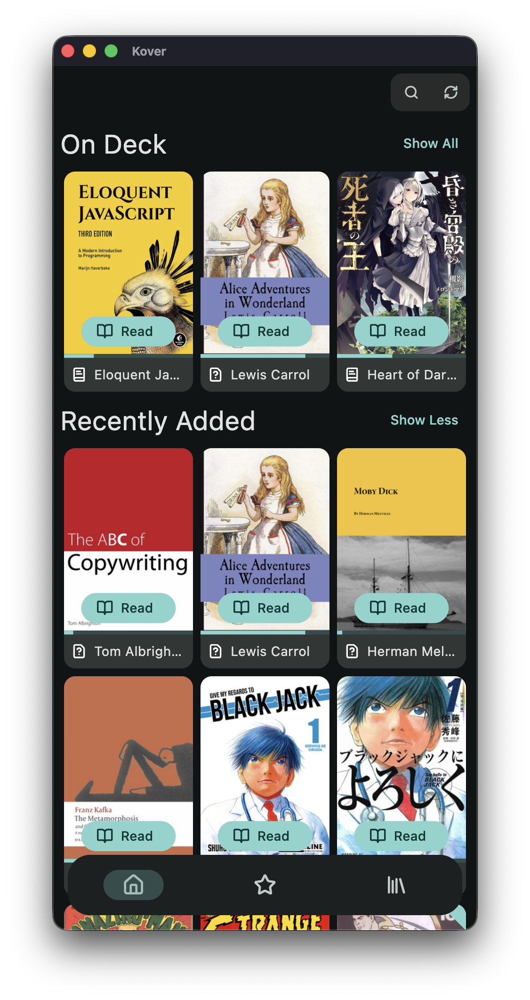
  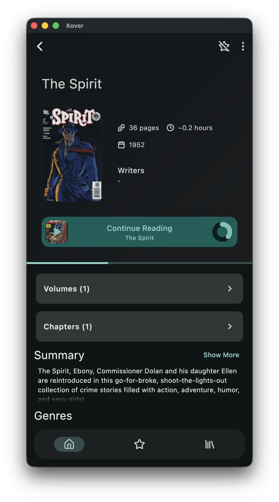
  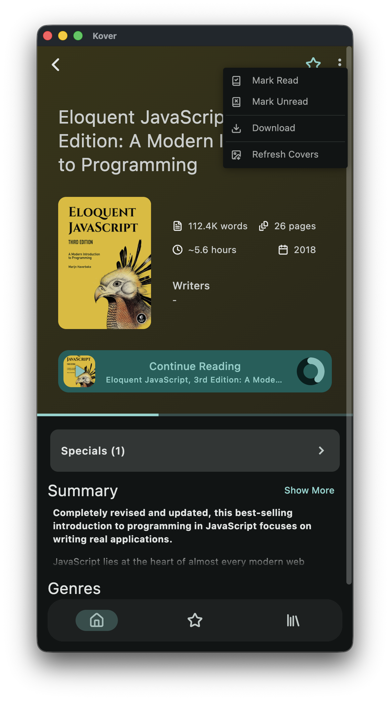
  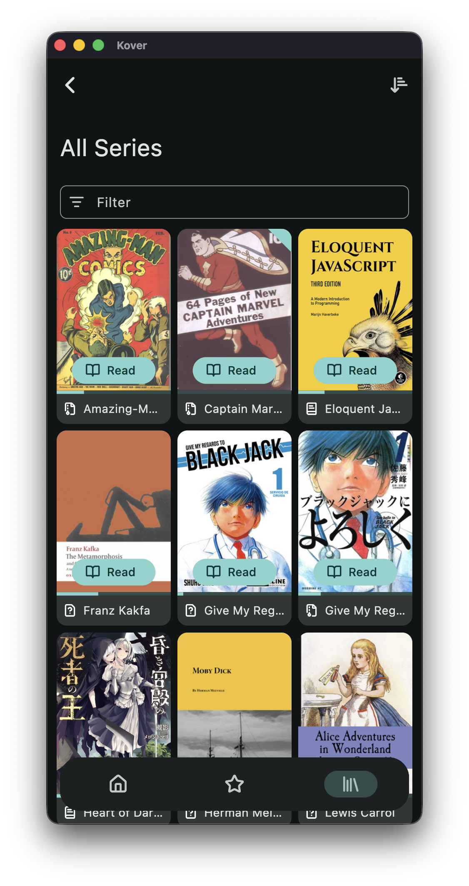
  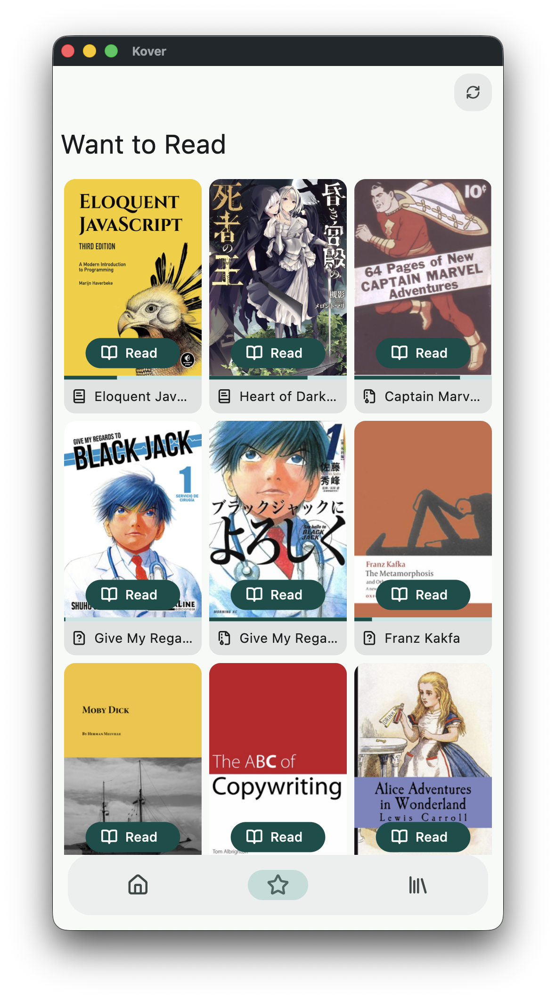
  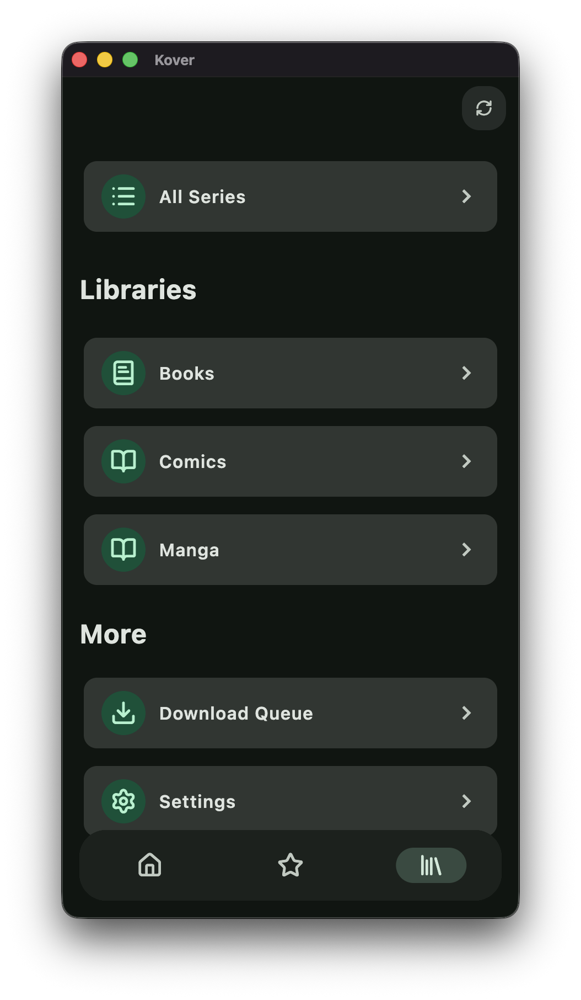
</p>

### Reading

<p align="center">
  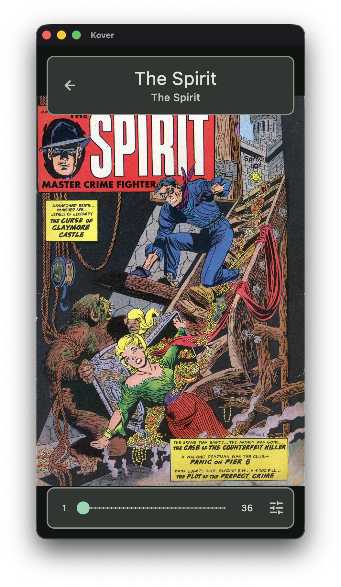
  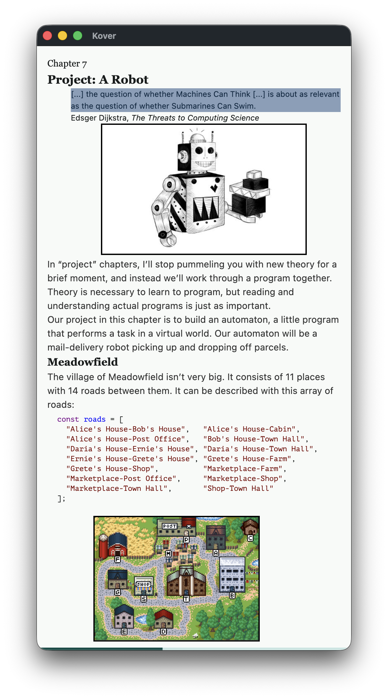
</p>

<p align="center">
  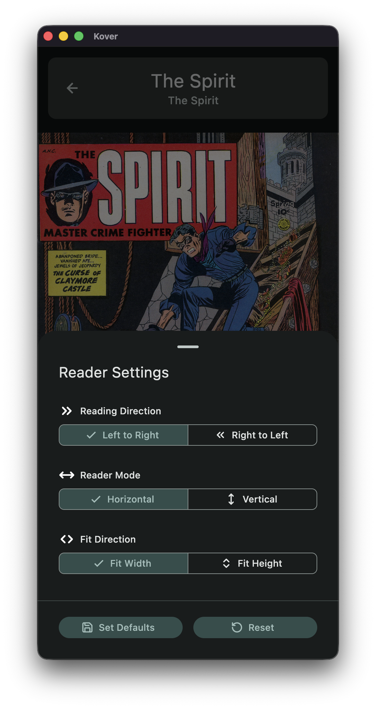
  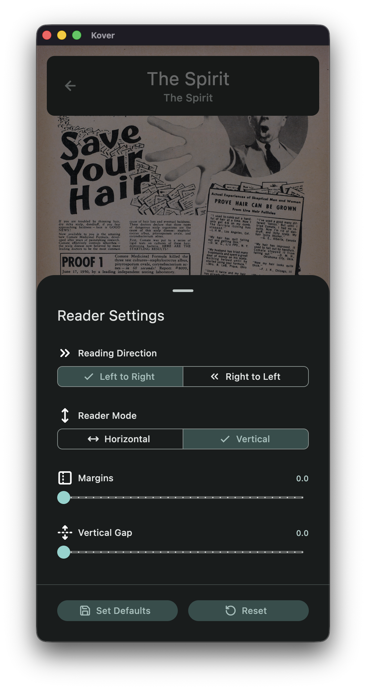
  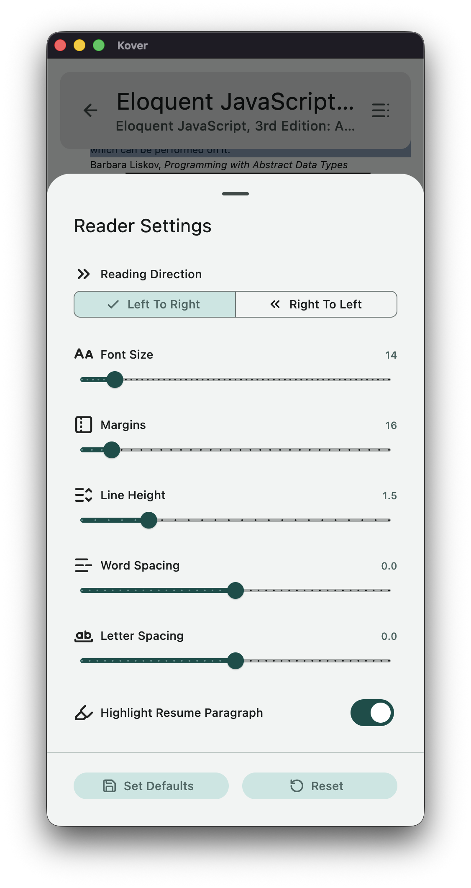
</p>

### Settings

<p align="center">
  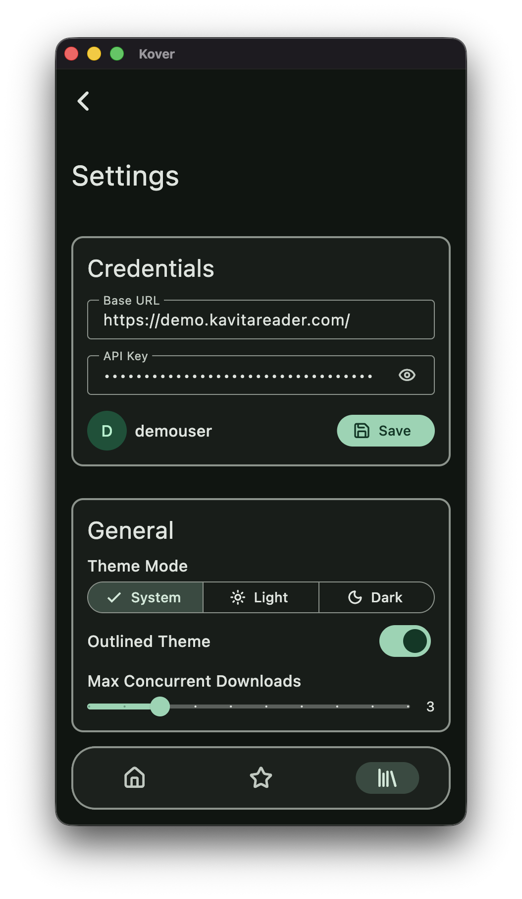
  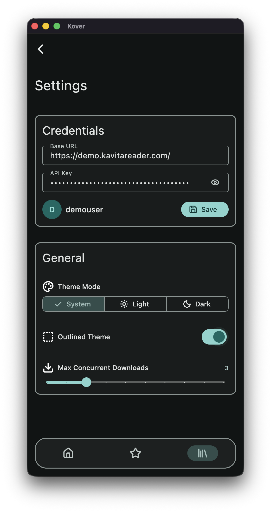
  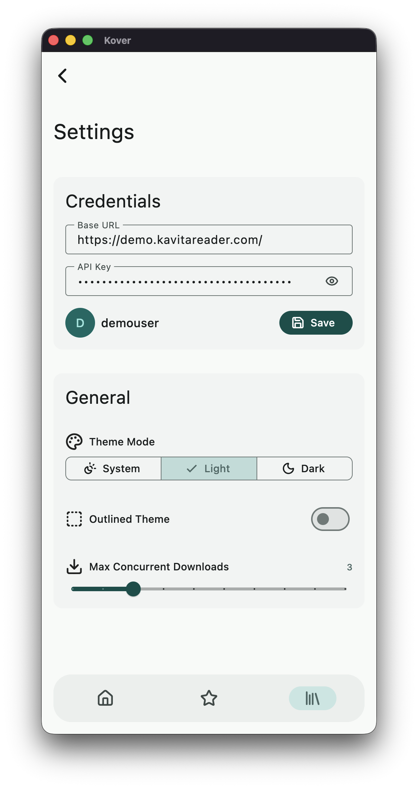
</p>
